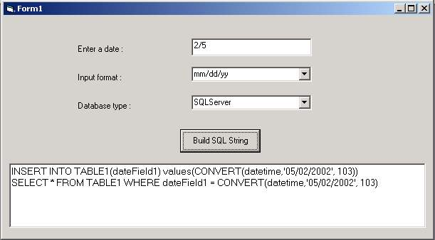



## Build SQL Date Expressions

### Description

If you want to build an application that can work with several database engines, the main problem you will have to deal with is the different ways for specifying date expressions.

This class will allow you to forget those differences. You can enter date strings in any format "dd/mm/yy", "mm/dd/yy", etc.. The class will validate the correctness of the date string and convert it into an expression you can use. Works for SQLServer, MySQL, Access, Informix and Oracle, and it's easy to add more engines.
 
### More Info
 
It's my first submission after downloading tons of code.. hope it's useful. Vote for it.

             |
---                |---
**Submitted On**   |2002-10-22 18:01:06
**By**             |[Eugenio Y\.](https://github.com/Planet-Source-Code/PSCIndex/blob/master/ByAuthor/eugenio-y.md)
**Level**          |Beginner
**User Rating**    |4.7 (42 globes from 9 users)
**Compatibility**  |VB 5\.0, VB 6\.0, ASP \(Active Server Pages\) 
**Category**       |[Databases/ Data Access/ DAO/ ADO](https://github.com/Planet-Source-Code/PSCIndex/blob/master/ByCategory/databases-data-access-dao-ado__1-6.md)
**World**          |[Visual Basic](https://github.com/Planet-Source-Code/PSCIndex/blob/master/ByWorld/visual-basic.md)
**Archive File**   |[Build\_SQL\_14869410252002\.zip](https://github.com/Planet-Source-Code/eugenio-y-build-sql-date-expressions__1-40145/archive/master.zip)

